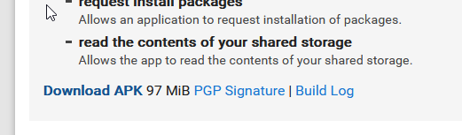
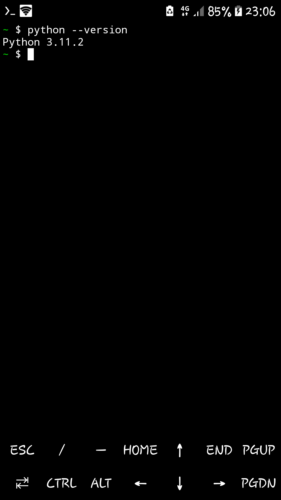
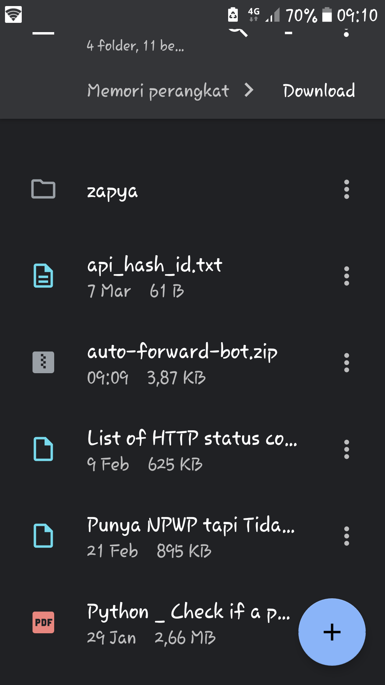
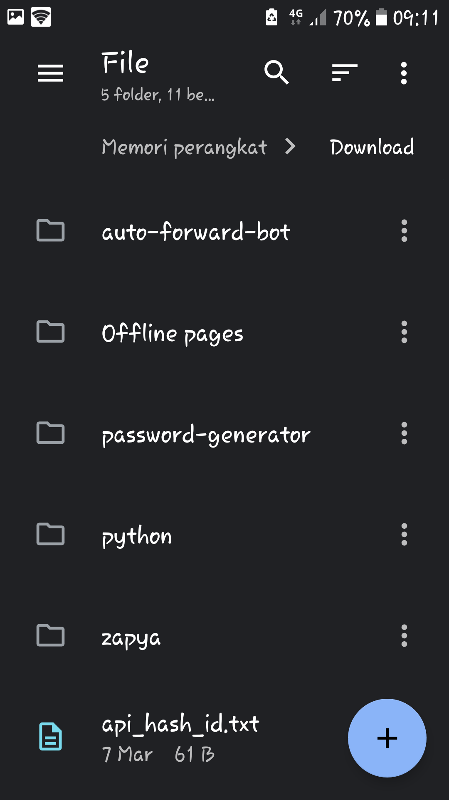
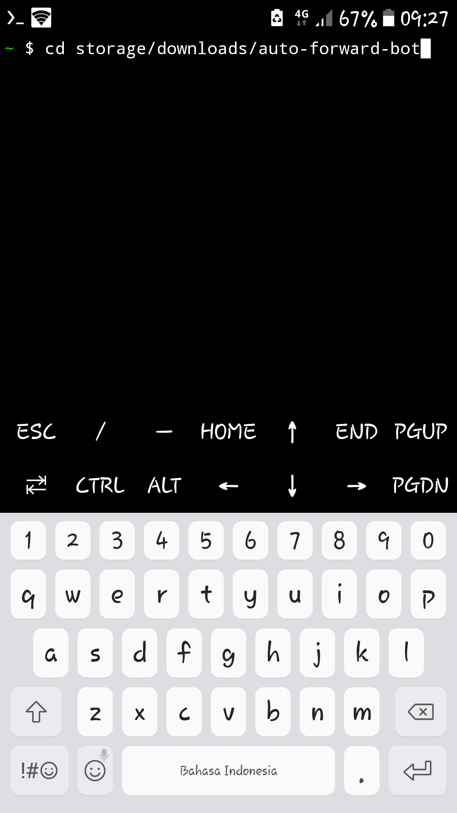
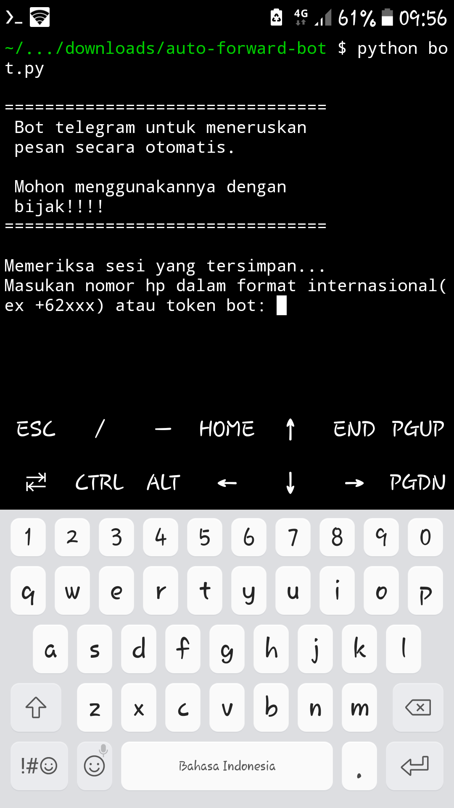
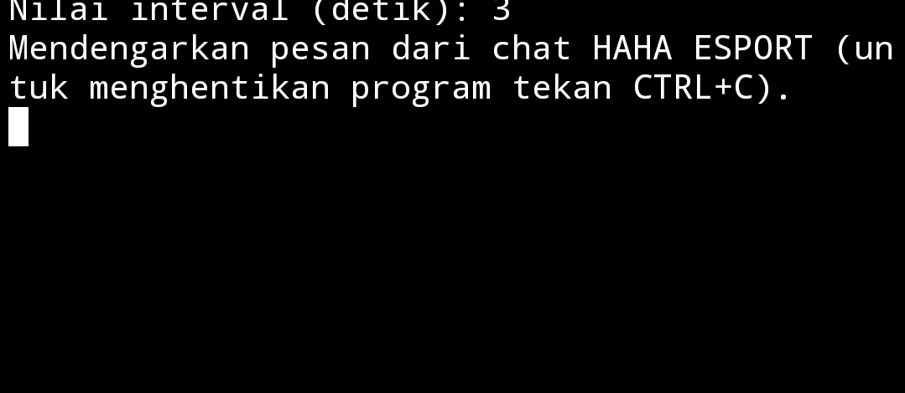

# auto-forwards-bot
Bot telegram untuk meneruskan/crossposting pesan ke grup secara otomatis.

**Gunakan program ini secara bijak jika anda tidak ingin akun anda dibn oleh telegram**

## Yang dibutuhkan
### Untuk hp android
1. Termux.
2. Python versi 3 keatas(rekomendasi versi 3.11+).
3. Package telethon dan pendukungnya(sudah ada di file `requirements.txt`)
4. Akun telegram aktif.
5. Api id dan api hash dari telegram.

## Instalasi termux dan python di android
1. Download dan install apk termux terbaru dari [sini](https://f-droid.org/en/packages/com.termux/). Pilih link seperti yang ada di gambar


    


2. Update dan upgrade repositori termux, ketik perintah berikut:

    ```
    pkg update && pkg upgrade
    ```

3. Install python, ketik perintah berikut:

    ```
    pkg install python
    ```

4. Cek instalasi python dengan perintah:

    ```
    python --version
    ```

    atau

    ```
    python3 --version
    ```

5. Jika berhasil maka akan keluar tulisan yang menunjukkan versi python yang terinstal. Seperti gambar dibawah

    

## Instalasi package python, menambahkan api id dan api hash, dan cara penggunaan

1. Beri izin termux untuk mengakses media penyimpanan, caranya ketik perintah `termux-setup-storage`. Kemudian jika muncul popup pilih allow app (proses ini cukup dilakukan sekali).

2. Buat api id dan api hash telegram jika belum punya, untuk membuatnya ada [disini](https://my.telegram.org/auth), untuk tutorialnya bisa lihat [video](https://youtu.be/8naENmP3rg4).

3. Simpan file `auto-forward-bot.zip` di tempat yang mudah diakses (disarankan di folder download di penyimpanan internal).



4. Ekstrak file `auto-forward-bot.zip` tersebut.



5. Buka termux kemudian pindah ke folder `auto-forward-bot` dengan ketik perintah `cd storage/downloads/auto-forward-bot` kemudian tekan Enter.



6. Install package yang diperlukan dengan ketik perintah `pip install -r requirements.txt` atau `pip3 install -r requirements.txt`, ikuti semua proses sampai selesai. 

7. Menambahkan api id dan api hash:

    1. Buka file `.env` di folder auto-forward-bot dengan text editor yang tersedia (di gambar menggunakan apk simple text editor) maka akan tampil seperti gambar dibawah, jika tidak terlihat buka setting/pengaturan di file manager kemudian cek pilihan tampilkan file tersembunyi.

    

    2. Salin dan tempel nilai api id dan api hash yang telah didapatkan ke file `.env` sesuai nilai masing-masing kemudian save files.

8.  Atur chat/grup utama:

    1. Buka file `config.ini` di folder auto-forward-bot dengan text editor yang tersedia (di gambar menggunakan apk simple text editor) maka akan tampil seperti gambar dibawah, jika tidak terlihat buka setting/pengaturan di file manager kemudian cek pilihan tampilkan file tersembunyi.

    

    2. Masukkan link/nama/id grup utama sesuai gambar diatas (contoh main_chat=https://t.me/<your_main_group>) kemudian save file.

9. Untuk menjalankan program, buka termux pindah ke folder `auto-forward-bot` caranya sesuai langkah nomor 5 (setiap akan menjalankn program ketik perintah tersebut), kemudian ketik perintah `python bot.py` atau `python3 bot.py`, jika tidak ada error maka akan muncul tampilan seperti gambar.



10. Ikuti semua proses yang muncul sampai seperti gambar dibawah.



11. Buka telegram kemudian tulis pesan di grup utama, program akan meneruskannya ke grup yang ada di daftar.

12. Untuk menambah/menghapus grup/chat buka file `grups.txt`, kemudian tambahkan link/nama/id grup yang baru, pastikan anda adalah member dari grup tersebut.

## Dibuat oleh
Author: Noertri

Email: trinuruns@gmail.com

WA/HP: +6285725397091

Telegram: [Noertri](https://t.me/Noertri)

Github: [Noertri](https://github.com/Noertri)